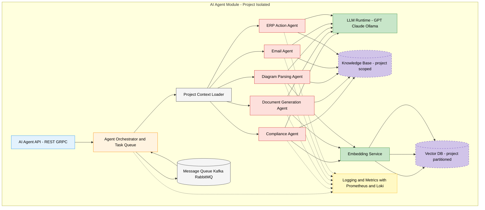
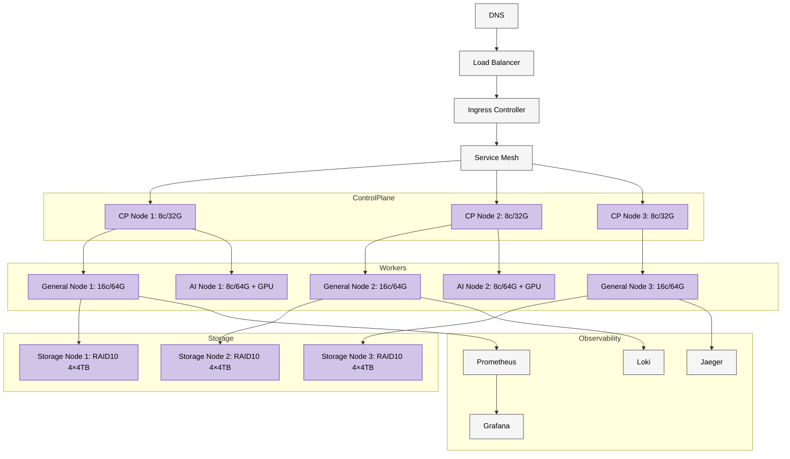
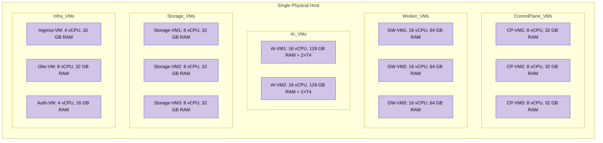
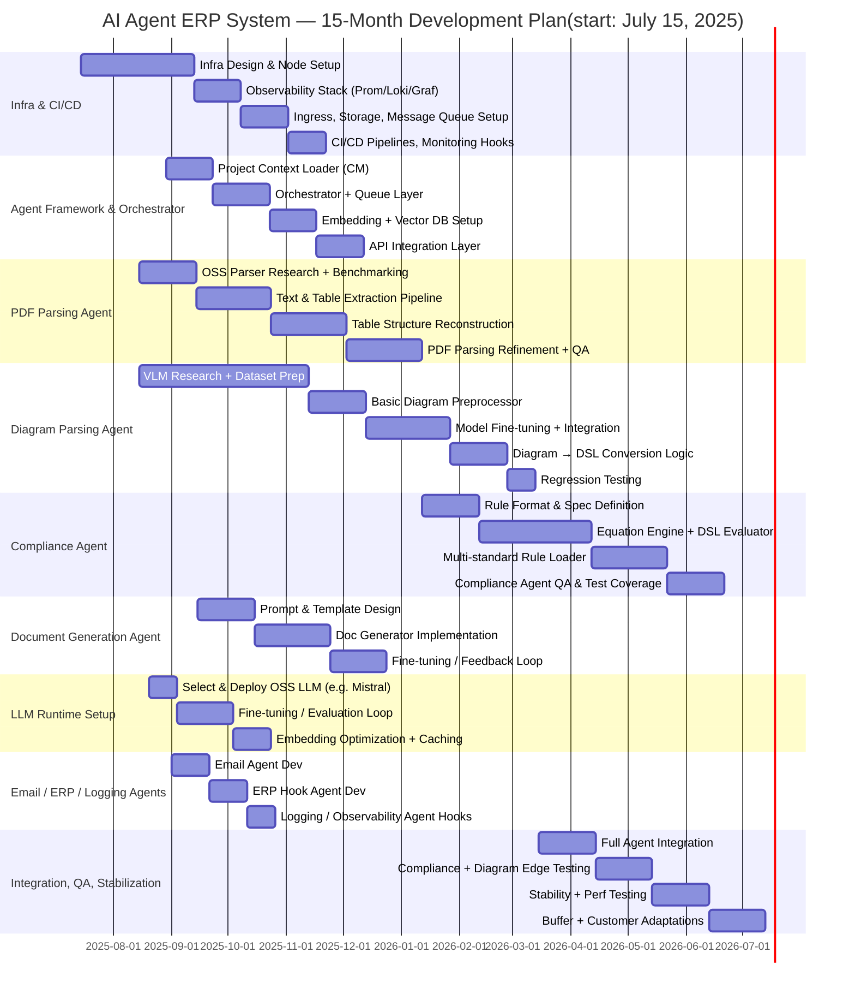

# Project Scope

## AI Agents Architecture

## AI Infra Architecture

## AI server slicing

## AI Server Pricing - Estimated (For 1000 users )

| Component                        | Qty | Unit Cost (INR) | Total (INR)     | Notes                                 |
| -------------------------------- | --- | ------------- | ------------- | ------------------------------------- |
| Intel Xeon Gold 6348 CPU         | 2   | 478,125       | 956,250       | Wikipedia RCP INR 3,072 × INR 83/USD        |
| 32 GB DDR4 ECC RDIMM             | 16  | 37,500        | 600,000       | Approx. INR 20K per 32 GB server module |
| NVIDIA Tesla T4 16 GB GPU        | 4   | 271,255       | 1,085,020     | ServerBasket list price               |
| 1 TB NVMe SSD (enterprise)       | 4   | 22,500        | 90,000        | Enterprise NVMe \~INR 12K/TB            |
| 8 TB HDD (enterprise, RAID-10)   | 12  | 37,500        | 450,000       | Enterprise 8 TB \~INR 20K each          |
| Dual-port 25 GbE NIC             | 2   | 46,875        | 93,750        | SFP28 cards                           |
| Dual-port 10 GbE NIC             | 2   | 22,500        | 45,000        | SFP+ cards                            |
| Chassis, PSUs, Board, Fans, etc. | —   | 187,500       | 187,500       | Supermicro or similar                 |
| **Scaled Total**                 |     |               | **3,507,520** | ~INR 35.1 lakhs (~INR 3.5M)              |

## Gannt Chart

